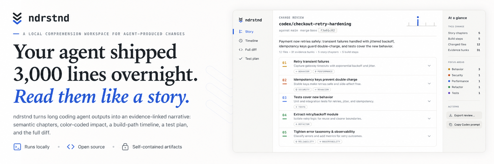

# ndrstnd

ndrstnd is a local comprehension workspace for large, agent-produced branch changes. It turns a branch diff into an evidence-linked Story, Timeline, Test plan, and Full diff instead of asking a reviewer to start in alphabetical path order.

## Install and start

    npm install -g ndrstnd
    ndrstnd auth login
    ndrstnd skill install
    ndrstnd review feature/my-change --base main --repo /path/to/repository

The command prints the review scope (base, changed files, whether uncommitted changes are included), drafts the narrative with your analysis agent (printing a heartbeat line every 15 seconds naming what the agent is doing, so a long analysis is never mistaken for a hang), then writes and opens a self-contained HTML review artifact. Artifacts live under the reviewed repository’s Git-ignored `.ndrstnd/` directory, are private to the local working copy, and are meant to be short-lived; delete them when the review is done.

ndrstnd analyzes with Codex or Claude Code and uses the agent’s existing authenticated session. It never stores a token itself.

## Choosing the agent

Every command accepts `--agent codex` or `--agent claude`:

    ndrstnd auth login --agent claude
    ndrstnd review feature/my-change --base main --agent claude

Without `--agent`, ndrstnd honors the `NDRSTND_AGENT` environment variable; then, when the command runs inside a Codex or Claude Code session (as it does when the installed skill triggers it), it uses that hosting agent; otherwise it falls back to the first installed CLI, preferring Codex. `ndrstnd auth status` reports both agents, and `ndrstnd skill install` installs the skill for every agent that is set up on the machine.

## Choosing the scope

Pick the invocation so the diff equals exactly the work being reviewed:

    ndrstnd review feature/my-change --base main       # committed work on a feature branch
    ndrstnd review --uncommitted                       # only uncommitted working-tree changes
    ndrstnd review --base $(git merge-base main HEAD)  # commits since branching plus uncommitted changes
    ndrstnd review --base empty                        # a repository with no useful base

Without a branch, ndrstnd reviews the checked-out branch including staged, unstaged, and untracked changes. When an inferred base would pull extra local commits into the review, ndrstnd warns before analyzing.

Add `--conversation path/to/ndrstnd-conversation-v1.json` to ground the narrative in the dialogue that produced the branch: motives, rejected alternatives, constraints, and any observed test runs feed the Story and the Test plan.

## Scope

ndrstnd is for understanding code: it explains the implementation story, evidence, risk signals, and selected lines. It deliberately does not critique the change, submit review comments, or edit the branch.

## Development structure

ndrstnd keeps deterministic transformation logic in small core modules and side effects at the boundary:

- `src/server/git-model.ts` parses Git output and classifies files; `src/server/git.ts` runs Git commands.
- `src/server/analysis-core.ts` builds prompts and validates the analysis contract; `src/server/analyze.ts` runs the analysis through the selected agent, which `src/server/agent.ts` resolves and `src/server/codex.ts` / `src/server/claude.ts` implement.
- `src/web/evidence-model.ts`, `src/web/test-plan-model.ts`, and `src/web/language.ts` derive presentation data; `src/web/page.ts` renders the self-contained artifact.

Run `npm run lint`, `npm test`, and `npm run build` before committing. The test suite includes pure unit tests, Git/HTTP/store integration tests, rendered artifact and browser-script UI tests, and an end-to-end artifact pipeline test.
